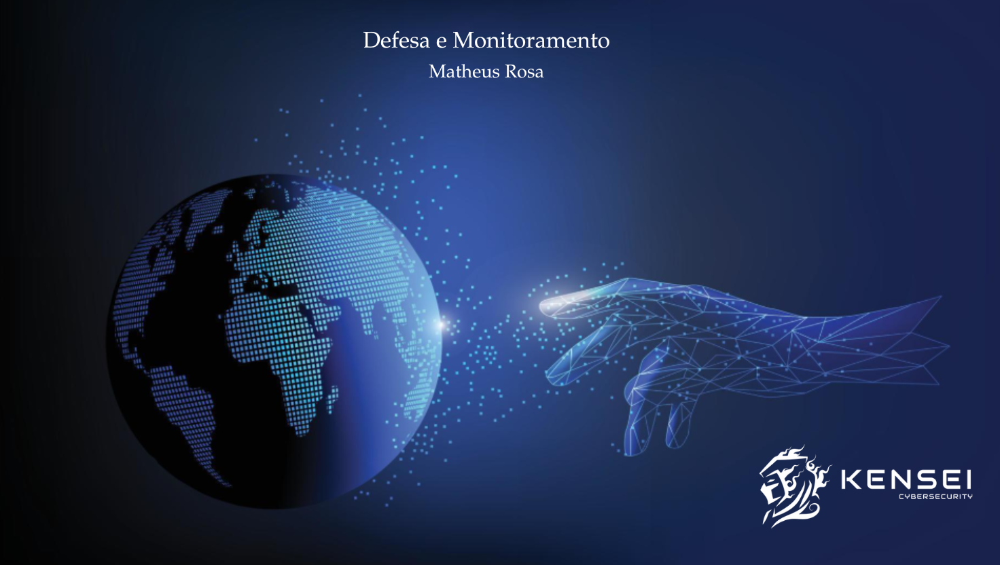

# Relatório – Opção 1 (Hands-on)

**Aluno:** Matheus Rosa  
**Data:** 27/09/2025

---

## 📑 Sumário Executivo

O ambiente contou com um **WAF (ModSecurity + CRS)** posicionado entre o atacante e a aplicação DVWA, além da atuação de um **Blue Team** responsável pela defesa via iptables.  
Foram simulados ataques de **SQL Injection** e **XSS**, validados em modo **blocking**, garantindo o retorno de erros 403 e evidências em logs do CRS. O nível de proteção alcançado foi satisfatório dentro do escopo proposto, mostrando evolução na maturidade de defesa.

---

## 🎯 Objetivo e Escopo

- **Defendido:** aplicação web vulnerável (DVWA).
- **Atacado:** endpoints do DVWA via requisições HTTP.
- **Limites:** cenário controlado, restrito ao ambiente de laboratório, sem extrapolação para sistemas externos.

---

## 🏗️ Arquitetura (Diagrama)

Fluxo de ataque e defesa estruturado em camadas:

1. Atacante (Kali) → envia payload malicioso (HTTP 8080).
2. WAF (ModSecurity + CRS) → analisa, bloqueia e loga.
3. DVWA → alvo protegido.
4. Blue Team → reforço via iptables/tcpdump.

  

## ⚙️ Metodologia

Etapas seguidas:

1. **Detecção:** identificação de ataques via logs e alertas CRS.
2. **Bloqueio:** resposta imediata do WAF (403 forbidden).
3. **Resposta:** ajustes em iptables e tuning de regras.
4. **Critérios de sucesso:** ataque detectado, bloqueado e evidenciado.

---

## 🛠️ Execução e Evidências

- **SQLi & XSS:** testes simulados, com bloqueios confirmados.
- **Modo blocking:** respostas HTTP 403 e registros nos logs do CRS.
- **Evidências coletadas:** tabela de eventos do WAF, pacotes tcpdump, prints dos testes e relatórios de tuning.

---

## 🛡️ Resposta a Incidente (NIST IR)

- **Detecção:** logs do CRS e falhas 403.
- **Contenção:** WAF atuando como camada primária de bloqueio.
- **Erradicação:** ajustes finos em regras CRS e iptables.
- **Recuperação:** restabelecimento da aplicação estável e segura.
- **Lições aprendidas:** necessidade de monitoramento contínuo e playbooks de incidentes.

---

## 💡 Recomendações (80/20)

Top 5 ações com maior impacto:

1. Ajustar regras CRS de acordo com o contexto da aplicação.
2. Criar dashboard para monitoramento em tempo real dos eventos do WAF.
3. Implementar redundância no WAF para maior resiliência.
4. Automatizar regras de iptables para respostas mais rápidas.
5. Treinar equipe Blue Team em playbooks e tuning avançado.

---

## ✅ Conclusão

A análise demonstrou que a arquitetura com WAF + Blue Team alcançou maturidade inicial em defesa contra ataques comuns (SQLi e XSS). A proteção foi efetiva no bloqueio, mas requer avanços em **monitoramento, automação e redundância**.  
Próximos passos incluem ampliar os testes para outros vetores de ataque e fortalecer a integração do time de resposta.

## 📎 Anexos

**https://github.com/MatheusRozza7/Cybersecurity-M-dulo-2.git**
